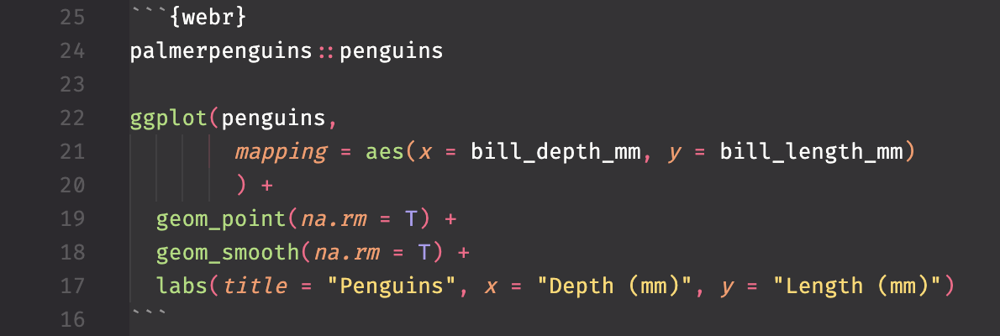

# Quarto WebR Syntax Highlighting Patcher

This tool patches the Quarto VS Code/Positron extension to add R syntax highlighting for `{webr}` code blocks in `.qmd` files.

## Why is this needed?

The Quarto extension doesn't natively support syntax highlighting for WebR code blocks. This patcher modifies the Quarto extension to treat `{webr}` blocks the same as `{r}` blocks, enabling proper syntax highlighting in the editor.

## Installation

```bash
git clone https://github.com/jacques-shebehe/quarto-webr-syntax-patcher.git
cd quarto-webr-syntax-patcher

# Patch both  Positron IDE and VS Code (default)
./patch-quarto.sh

# Or patch only a specific IDE:
./patch-quarto.sh --positron  # Positron IDE only
./patch-quarto.sh --vscode    # VS Code only
```

Then restart the patched IDE(s).

## What it does

The script makes three modifications to the Quarto extension:

1.  **Adds a webr code block definition** to `quarto.tmLanguage` that matches `{webr}` blocks
2.  **Registers webr in embeddedLanguages** in `package.json` to use R syntax
3.  **Includes webr in the patterns array** so the grammar recognizes it

## Usage

After patching, your `{webr}` code blocks will automatically have R syntax highlighting:



## Command-Line Options

The patcher supports the following options:

```bash
./patch-quarto.sh [--positron|--vscode|--both]
```

- `--positron` - Patch only Positron IDE
- `--vscode` - Patch only VS Code
- `--both` - Patch both IDEs (default)
- `-h, --help` - Show help message

## After Quarto Extension Updates

When the Quarto extension is updated, you'll need to re-run the patcher:

```bash
./patch-quarto.sh
```

The script automatically:

- Finds all installed Quarto extensions
- Checks if already patched
- Creates backups before modifying
- Supports patching specific IDEs or both

## Uninstalling

To restore the original Quarto extension, use the unpatch script:

```bash
# Unpatch both IDEs (default)
./unpatch-quarto.sh

# Or unpatch only a specific IDE:
./unpatch-quarto.sh --positron  # Positron only
./unpatch-quarto.sh --vscode    # VS Code only
```

The unpatch script will:

- Automatically find patched extensions
- Restore original files from backups
- Verify the restoration was successful
- Inform you about backup files that can be deleted

Then restart the IDE(s).

## Requirements

- Windows, macOS, or Linux
- VS Code or Positron with the Quarto extension installed
- Bash shell (Git Bash on Windows)

## Acknowledgments

This tool was crafted with assistance from the AI in [Warp Terminal](https://www.warp.dev/), which helped make the patcher cross-platform and resolve Windows compatibility issues.

## License

MIT
